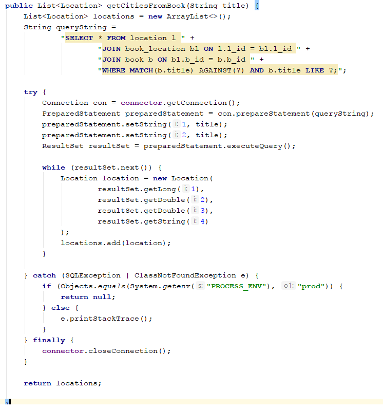

## 9. Describe JDBC - purpose and use

Java Database Connectivity (JDBC) is an application programming interface (API) for the programming language Java, which defines how a client may access a database. It is part of the Java Standard Edition platform, from Oracle Corporation. It provides methods to query and update data in a database, and is oriented towards relational databases. //wiki

JDBC allows multiple implementations to exist and be used by the same application. The API provides a mechanism for dynamically loading the correct Java packages and registering them with the JDBC Driver Manager. The Driver Manager is used as a connection factory for creating JDBC connections.

JDBC connections support creating and executing statements. These may be update statements such as SQL's CREATE, INSERT, UPDATE and DELETE, or they may be query statements such as SELECT. Additionally, stored procedures may be invoked through a JDBC connection. 

JDBC represents statements using one of the following classes:

- Statement – the statement is sent to the database server each and every time.
- PreparedStatement – the statement is cached and then the execution path is pre-determined on the database server allowing it to be executed multiple times in an efficient manner.
- CallableStatement – used for executing stored procedures on the database.

Update statements such as INSERT, UPDATE and DELETE return an update count that indicates how many rows were affected in the database. These statements do not return any other information.

Query statements return a JDBC row result set. The row result set is used to walk over the result set. Individual columns in a row are retrieved either by name or by column number. There may be any number of rows in the result set. The row result set has metadata that describes the names of the columns and their types

Eksampel:
